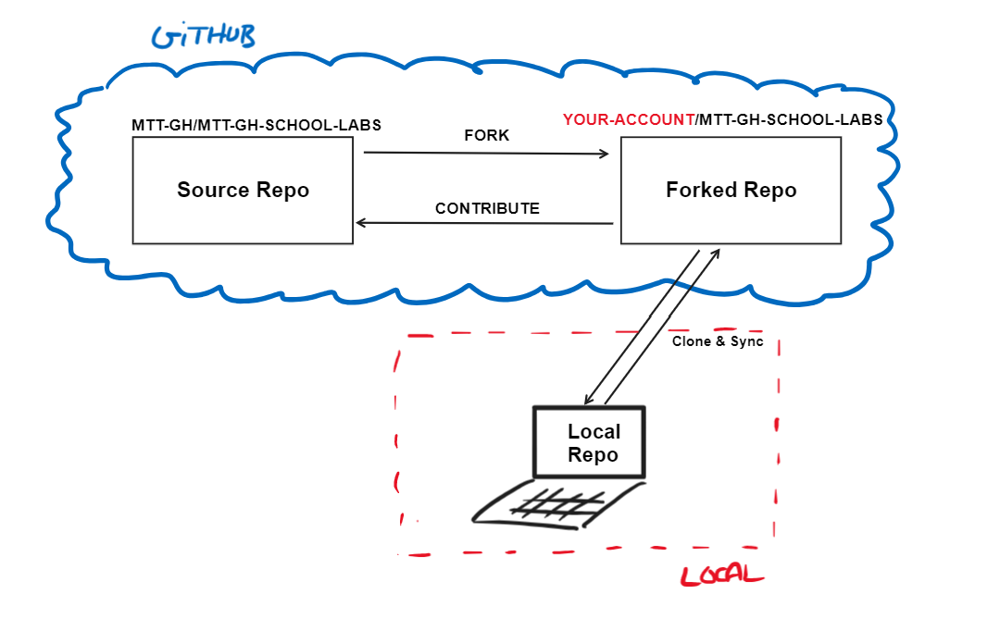

### Lab 2: Create a Pull Request (Beginner)
You are going to create your first Pull Request (PR), from a forked repository to the source one. This is the most common way to collaborate on a public repository (as many OSS projects do). You will need to
    1. Create a fork of the source repo (upstream)
    2. Make changes to a branch in the fork
    3. Create a PR from the fork to the upstream repo (source).

Before starting, lets cover some basic concepts:

- A repository being public **does NOT mean anyone can make changes to it (only Maintainers)**. You need to be granted permissions to do so or **you need to propose changes using a fork of the source repo for experimentation**. In the case of the MOC content, only the Content Owner (Content Devs in a real life scenario) has permissions to make changes to the original repository. MTTs need to collaborate using Forks and PRs.
- A **Pull Request (PR)** is a request to merge changes from a branch in a forked repo, to a branch in the source repo. The PR is used to propose changes to the source repo, it is a "conversation" between the contributor and the Content Owner (maintainer). The Content Owner will review the PR and collaborate with the contributor to make sure the PR is ready to merge. The PR is the most common way to collaborate in Git repositories.
- In your case you will have:
    - **MTT-GH/MTT-GH-SCHOOL-LABS repo (Upstream)**: The **source repo**. The "stable" version of the content. The repo that contains the original content.
    - **YOUR-ORG-OR-ACCOUNT/MTT-GH-SCHOOL-LABS repo (Fork)**: The **forked repo**. A copy of the source repo in your GitHub account. You will be making changes to this repo.
    

    
    
    > NOTE!: No local environment will be used. The labs will show the easiest way of collaborating directly in GitHub. 

#### Exercise

1. Go to the MTT-GH/MTT-GH-SCHOOL-LABS repo (if not there already). Lets try to make a change to the source repo to see what happens.
1. In **Code** tab, go to the `Instructions/WebApp-Lab.md` file. Look for the following table syntax issue reported on previous lab. 

    

1. Open the editor clicking on the edit icon (pencil, top right corner). You will see the following warning message:

    

1. The warning explains how a fork a Fork is needed to propose changes to the repository (based on the logged account). Click on **Fork This repository**. 

1. You will see the next warning is telling you that the changes proposed from now on, will be created on a branch of your forked repository.

1. Start by proposing the change to the table format. You can use the **Preview** tab to see how the table will look like once the changes are applied.

    

1. Go to the top right corner and click on the **Commit changes...** button, provide a descriptive message for the commit. For example: **Fix table format**. Leave the **extended description** empty. Click on **Propose changes**.
1. At this point you have made the **changes to a branch (default name given, for example, "patch-1") in your forked repo**. You need to create a PR from your fork to the source repo to propose the changes. The GitHub UI will guide you through the process of opening a PR from your fork to the source repo.

    

1. Click on **Create pull request**.

1. In the **Open a pull request** window, provide a descriptive title for the PR. For example: **Fix table format in WebApp-Lab.md**. Provide a description to the PR. For example:

    ```The table format is not correct. The table is not rendered correctly.```    
1. As this PR is trying to fix and existing/reported issue, you can include a reference to the issue (use your Issue number #) in the PR description.**This is great to trace the status of the issue from both the Issue or PR (on the Development field of the items, right column)**. Include a reference to the issue in the PR description. For example:

    ```Fixes #2```
    
    >NOTE!: replace "#NUMBER" with a reference to you own issue.

1. Click on **Create pull request**. Your PR should be created and look similar to the following [PR](https://github.com/MTT-GH/MTT-GH-SCHOOL-LABS/pull/2).

1. Now if you open the GH Issue from lab one, you will see a reference to the PR that fixes the issue. 

    
