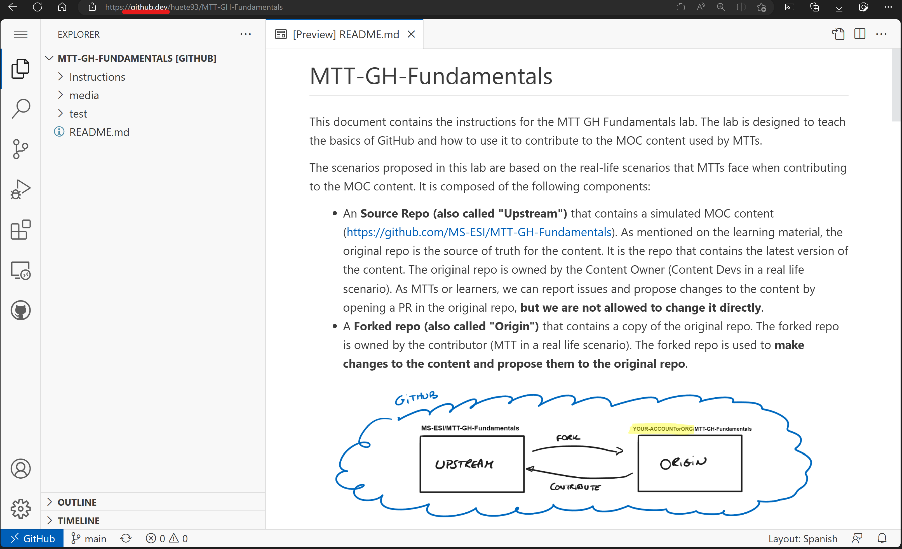
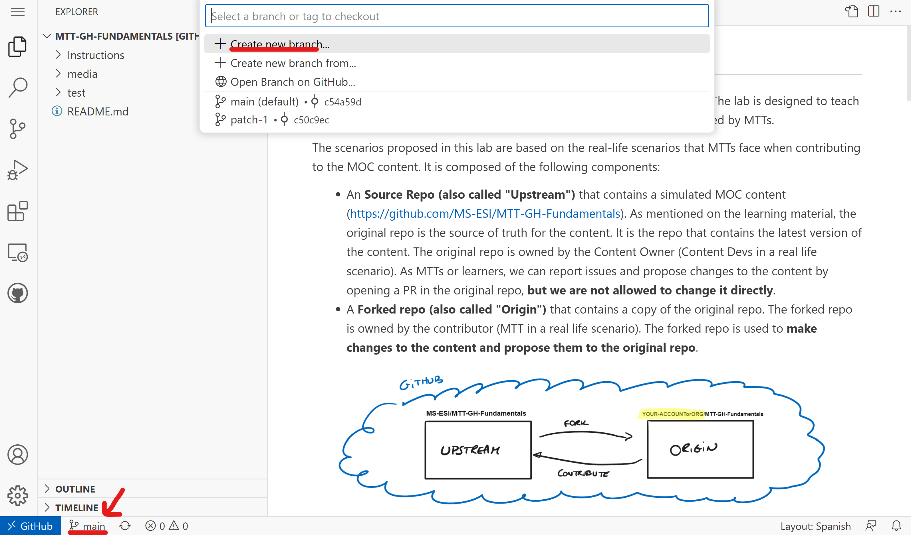
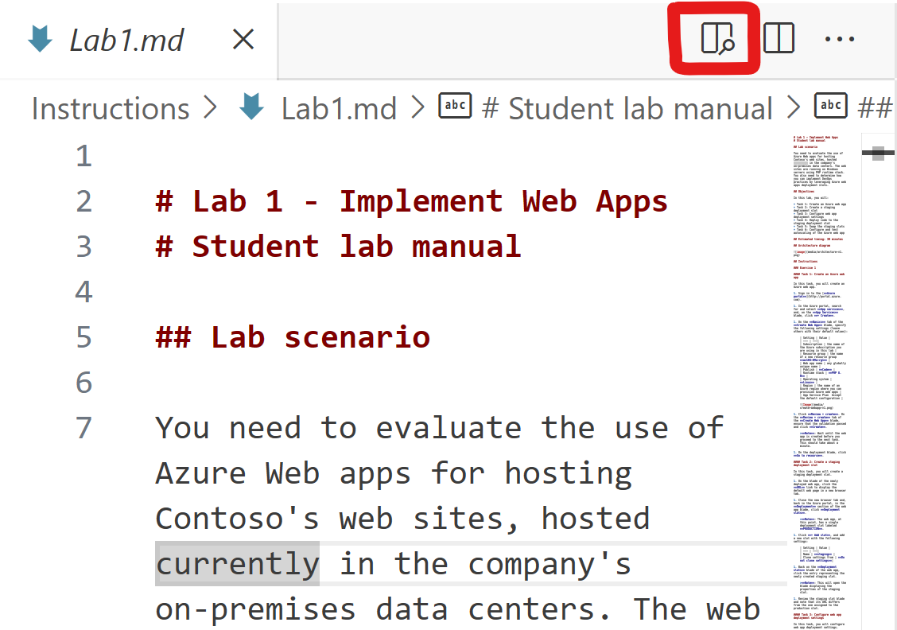
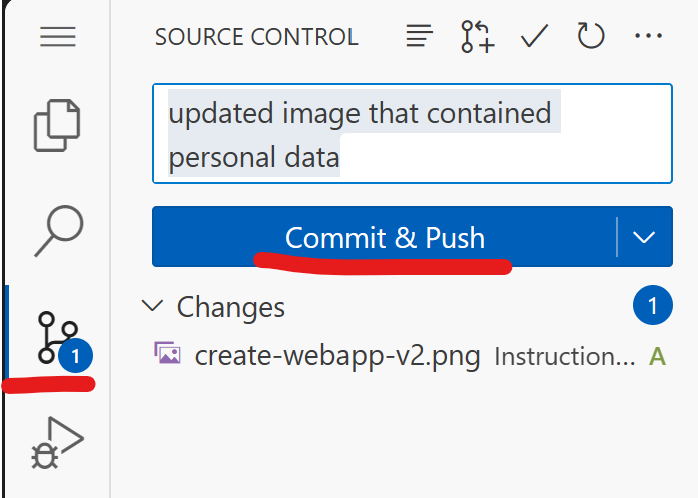

### Lab 3: Create a Pull Request (Intermediate)
On this lab, you are going to create a PR from the forked repo, proposing an image update based on a [reported GitHub Issue](https://github.com/MTT-GH/MTT-GH-SCHOOL-LABS/issues/3)

**ISSUE!** The image in the example lab file at`Instructions/WebApp-Lab.md` is outdated and contains trainer personal data. The image should be updated to reflect the latest UI changes. Use tools like Snagit to capture the new screenshot and propose the change in the PR.

This time you will use a different way to edit files on GitHub. You will still use the GitHub UI for it (no local/cloned repo and Visual Studio used, simplifying the process). Advanced developers may prefer to use a local repo and a local editor like Visual studio Code to make changes to the files. This is out of scope for this lab.

#### Exercise

1. Go to the forked repository **YOUR-ORG-OR-ACCOUNT/MTT-GH-SCHOOL-LABS** on GitHub (if not there already).

1. Make sure you are in the **Code** tab. Open the GitHub Web Editor by clicking on "." on your keyboard. You can also lightly change the URL to **github.dev/...** instead of **github.com/...**. This will open the **GitHub Web Editor** which works as a Visual Studio Code editor in the browser.

    

    >**NOTE:** The GitHub Web Editor is a great way to make quick edits to files in a repo. It **cannot be used for testing or running code**. For that purpose, you will need to clone the repo and use a local editor or use [GitHub Codespaces](https://github.com/features/codespaces) 

1. Start by creating a new branch to propose the mentioned changes. On the bottom left corner, click on the **main** branch and select **Create new branch**. Provide a descriptive name for the branch. For example: **update-image**. Click on **Enter** and **Switch to branch**.

    

1. Now your repository will be pointing to the new **update-image** branch. You can start making changes to the files in this new branch on your forked repo.

1. In order to edit Markdown files, it is helpful to open the **Markdown Previewer**. Open the **Instructions/WebApp-Lab.md** file and click on the **Open Markdown to the side** icon on the top right corner.

    

1. Review the **WebApp-Lab.md** file and you will see in line 51 that the image **create-webapp-v1.png** contains personal data. You will need to update the image to reflect the latest UI changes and avoid personal data. Use tools like **Snagit** to capture the new image and propose the change in the PR.

1. Use your preferred tool to capture a new **Create Web App** screenshot, hide personal data (blur/paint on top) and save it locally as **create-webapp-v2.png**. 

    

1. Upload the picture to **Instructions/media** folder by right clicking on the folder and selecting **Upload ...**. Upload the new image.

1. Go to the lab file **Instructions/WebApp-Lab.md** and update the image reference in line 51 to the new image. Save file (CTRL+S). For example:

    ``````

1. Create a new commit for these changes. Click on the **Source Control** icon on the left menu. You will see the changes you have made to the files in the repo. Provide a descriptive message for the commit. For example: **updated image that contained personal data**. Click on **Commit and push**. Remmember that **Commit** is "packaging" those two changes and giving a description it, **Push** will send those changes to your repo (from the GitHub web editor environment to the GitHub repository).

    

1. As you do not need the old version of the screenshot, delete the old **create-webapp-v1.png** file by right clicking on the file and **Delete Permanently > Delete**. Click on the **Source Control** icon on the left menu. Create another commit as before, providing a descriptive message for the commit. For example: **deleted old image that contained personal data**. Click on **Commit and push**.

1. Go back to the repository page at **github.com/...** . At this point you have a ready merge new branch ("update-image") on your forked repo. 

1. You need to create a PR to propose the changes. The GitHub UI will guide you through the process of opening a PR from your fork to the source repo. (You could also open the PR from the **Source Control** tab in the GitHub Web Editor)

1. Click on **Compare and pull request**. Make sure your are targeting the **main** branch of the source repo  from your forked repo **update-image** branch. Provide a descriptive title for the PR. For example: **Update image that contained personal data**. Provide a description to the PR and reference to the existing [#3 GitHub Issue](https://github.com/MTT-GH/MTT-GH-SCHOOL-LABS/issues/3), and create the Pull Request. For example:


    ```
    The image in the example lab file at Instructions/WebApp-Lab.md is outdated and contains trainer personal data. The image should be updated to reflect the latest UI changes. 

    Fixes #3
    ```

You successfully edited the forked repository using the GitHub Web Editor and created a PR to propose the changes that will fix reported issues on the source repository.

