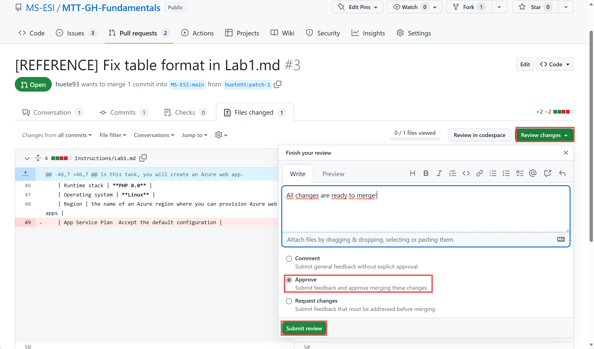
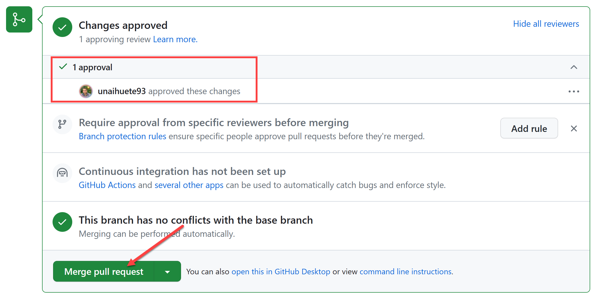

### Lab 4: Review a Pull Request (Beginner)
Imagine you are the Content Owner/Courseware Lead. Review and collaborate with the contributor to make sure the PR is ready to merge.

You will include a reference to the GH Issues that are fixed by this PR.
#### Exercise

In this exercise you will review an existing Pull Request to understand the artifacts included and necessary steps to approve/merge a PR. **You will only review the existing options as part of the exercise, no actions expected! (the content dev usually takes the ownership of this part)**. 

1. Go to the source repository "MS-ESI/MTT-GH-Fundamentals" on GitHub.
1. Click on the **Pull requests** tab.
1. Open the Pull Request with title **[REFERENCE] Fix table format in WebApp-Lab.md**. It is a PR similar to the one done in Lab 2, it fixes a table format in the WebApp-Lab.md file.
1. On the **Conversation** tab, you can review the conversation between the contributor and the reviewer. You can see the PR actitity, changes/commits, comments, approval, etc. 
1. On the **Commits** tab, you can review the commits included in the PR.
1. On the **Checks** (not used in this labs) tab, you can review the status of the checks included in the PR. Checks are validations for your code you can automatically execute in a GitHub Actions (like linting, building code, unit testing, etc.).
1. On the **Files changed** tab, you can review the files included in the PR and the changes proposed. You can also **add comments** to the PR on specific lines of code (using the "+" icon).
1. On the **Development** tab, you can see the related issues (either added manually or automatically by using the **Fixes #X** syntax on the PR description).
1. (For content Developers) As you can see on the reference PR, on the **Reviewers** field, a reviewer has been assigned (by the maintainer). The reviewer will have to review the proposed changes (**Files changed** tab), provide feedback and approve the PR. Once the PR is approved, the maintainer will merge the PR to the main branch. 

    

    

**As an MTT you could help Content Developer by reviewing the proposed changes and providing feedback/comments.**

If the PR would be merged (left opened on purpose for review), you would see the following:
- The PR would merge changes to the main branch of the source repository.
- The PR would be closed.
- The referenced Issue would be closed.

    

On this lab you have reviewed an existing Pull Request to understand the artifacts included and necessary steps to approve/merge a PR.

