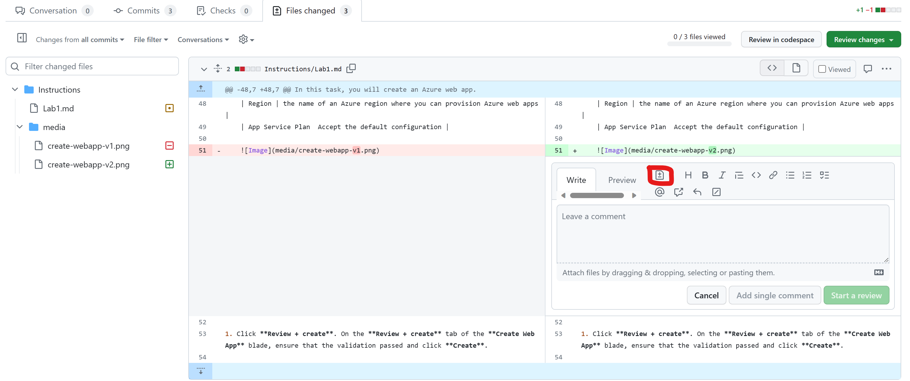
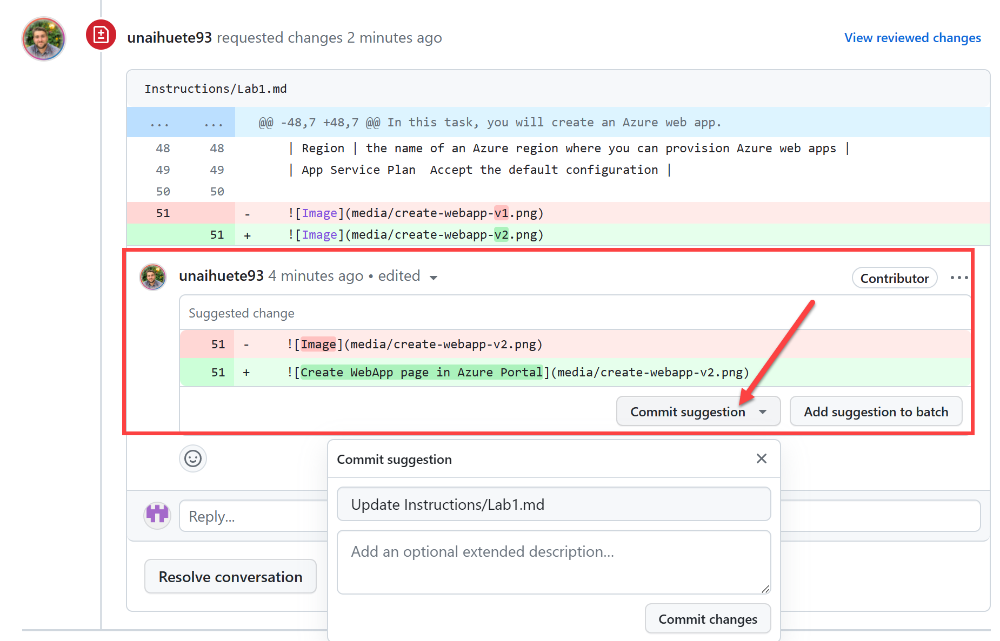

## Lab 5: Review a Pull Request (Intermediate)
Imagine you are the Content Owner/Courseware Lead. Review and collaborate with the contributor to make sure the PR is ready to merge.

This time, **a change will be suggested to the proposed PR from the maintainer**. The contributor will need to accept the change and update the PR.

#### Exercise

In this exercise you will review an existing Pull Request to understand the artifacts included and necessary steps to approve/merge a PR. **You will only review the existing options as part of the exercise, no actions expected! (the content dev usually takes the ownership of this part)**.

1. Go to the source repository **MTT-GH/MTT-GH-SCHOOL-LABS** on GitHub.
1. Click on the **Pull requests** tab.
1. Open the Pull Request with title **[REFERENCE] Update image that contained personal data**. It is a PR similar to the one done in Lab 3, it fixes an image that contained personal data.

Let´s imagine, as a Content Developer, you want to suggest a change to the opened PR **(PR not ready to merge)**. You can add a comment and wait for the change or **suggest the change you are looking for**. Lets review the second option.

**REMINDER you are not expected to execute the next steps, it is just for showing the process (maintainer will do it) **

1. In the **Files changed** tab, you could suggest a change on line 51, clicking on "+" and  **Add a suggestion** button.

    

1. Lets imagine we would like a more complete ALT text for the image, the "[]" section defines the ALT text. As a maintainer , you would change the proposed suggestion and click on **Start a review**:

    ```
        ```suggestion
            
        ```
    ```
1. On the top section you would click on **Finish your review > Submit review**. 
1. Now the PR creator (collaborator) would get a message with the changes asked by the maintainer (Content Owner) and could **Commit suggestion** included on the proposed changes.

    

On this lab, you have reviewed an existing PR and reviewed how to suggest a change to the PR creator.
