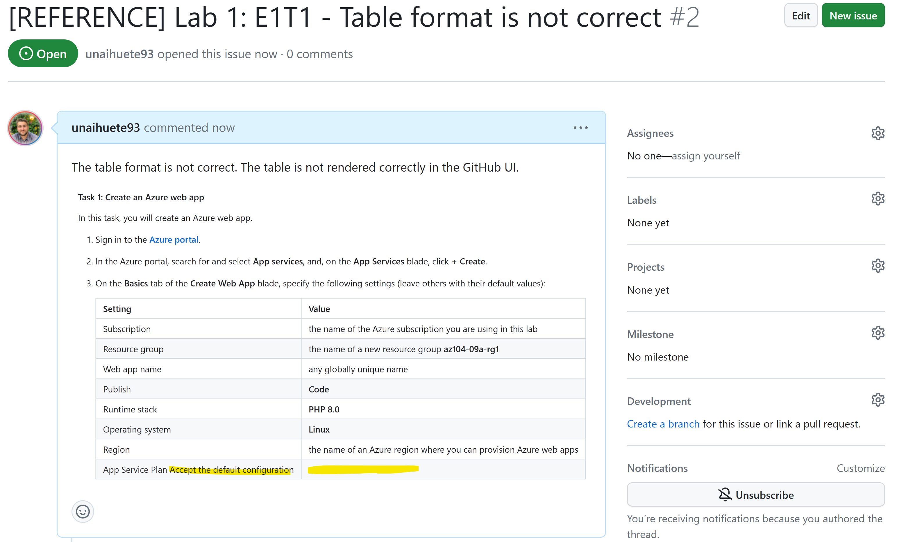

# MTT-GH-Fundamentals

This document contains the instructions for the MTT GH Fundamentals lab. The lab is designed to teach the basics of GitHub and how to use it to contribute to the MOC content used by MTTs.

The scenarios proposed in this lab are based on the real-life scenarios that MTTs face when contributing to the MOC content. It is composed of the following components:

- An **Source Repo (also called "Upstream")** that contains a simulated MOC content (https://github.com/MS-ESI/MTT-GH-Fundamentals). As mentioned on the learning material, the original repo is the source of truth for the content. It is the repo that contains the latest version of the content. The original repo is owned by the Content Owner (Content Devs in a real life scenario). As MTTs or learners, we can report issues and propose changes to the content by opening a PR in the original repo, **but we are not allowed to change it directly**.
- A **Forked repo (also called "Origin")** that contains a copy of the original repo. The forked repo is owned by the contributor (MTT in a real life scenario). The forked repo is used to **make changes to the content and propose them to the original repo**.


You could also involve a local clone (copy) of the repo in your local machine. **This is not required for the lab, it will try to teach the easiest way to collaborate with GitHub, only using web interface tooling**. 

You can perfectly collaborate in the MOC content without cloning the repo to your local machine. You can use the GitHub web interface to open issues, create PRs, review PRs, etc. This is the most common way to collaborate in GitHub as MTTs.


## Pre-requisites
- Make sure you have a **GitHub account**. If you don't have one, you can create one for free at https://github.com/join. Identify yourself as Microsoft MTT in your Profile (TODO guidelines?).
- Review the Learning material in ADD WEBSITE.

## Repository Structure
The repository is composed of the following files/folders:
- **README.md**: This file. Contains the instructions for the lab.
- **Instructions** folder: Contains the instructions for the demo lab we will collaborate in.
    - **media** folder: Contains the images used in the instructions.
    - **Lab1.md**: Instructions for the first demo lab.

## Lab Instructions

### Lab 1: Create a GH Issue
In this lab you are going to report an existing issue in the content by opening a new issue in the source repo (Upstream). This is the most common way to report an issue. 

GitHub Issues are used not only to report bugs, but also to propose new features, ask questions, etc (you can use labels for categorizing). It is something similar to work items used by Azure DevOps.

When creating a new issue, you should provide:
- A descriptive title linked to the Lab and Issue
- Clear issue description
- Include screenshots or other media (if that helps to understand the issue)
- (TODO In [Lab 4](#lab-4-review-a-pull-request-intermediate)) Include a link to the PR that fixes the issue.

#### Exercise: Create a new issue

1. Make sure you are in the MS-ESI/MTT-GH-Fundamentals repo. You are going to use the source repository to report an issue found in the lab.
1. Go to the [Lab1.md](Instructions/Lab1.md) file.

1. On Exercise 1 > Task 1 you can see there is an issue with the table format. You will be reporting this issue in the source repo (Upstream).

    

1. Click on the **Issues** tab in the repo (make sure you are in the MS-ESI/MTT-GH-Fundamentals repo). Click on the **New issue** button.

1. Provide a descriptive title for the issue. For example: **Lab 1: E1T1 - Table format is not correct**.
1. Provide a description to the issue. For example:

    ```The table format is not correct. The table is not rendered correctly in the GitHub UI.```
1. Include an image of the issue. You can use the Snagit tool (or others) to capture the image and pointing the problem. You can attach it just by **pasting** into the issue description.

1. Click on the **Submit new issue** button. Your issue should be created and look similar to the following one:

    


### Lab 2: Create your first Pull Request (Beginner)
Create a PR directly from the GitHub UI in the original repo. This is the easiest way to create a PR. You can also create a PR from a forked repo, but that is a bit more complicated.

**ISSUE**: Simple typo in the `Lab1.md` file, for example, bold text is not closed.

### Lab 3: Create a Pull Request (Intermediate)
Create a PR from a forked repo. This is the most common way to create a PR. You will need to create a fork of the original repo, make changes to the fork, and then create a PR from the fork to the original repo.

**ISSUE**: Multiple formatting issues in the `Lab1.md` file. Tables with wrong formatting, NOTE with incorrect indentation, etc.
### Lab 3: Create a Pull Request (Advanced)
Create a PR from the forked repo, proposing a image update.

**ISSUE**: The image in the `Lab1.md` file is outdated and contains trainer personal data. The image should be updated to reflect the latest UI changes. Use tools like Snagit to capture the new image and propose the change in the PR.

### Lab 4: Review a Pull Request (Intermediate)
Imagine you are the Content Owner/Courseware Lead. Review and collaborate with the contributor to make sure the PR is ready to merge.

You will include a reference to the GH Issues that are fixed by this PR.

## Lab 5: Review a Pull Request (Advanced)
Imagine you are the Content Owner/Courseware Lead. Review and collaborate with the contributor to make sure the PR is ready to merge.

You will suggest a change to the proposed PR. The contributor will need to accept the change and update the PR.