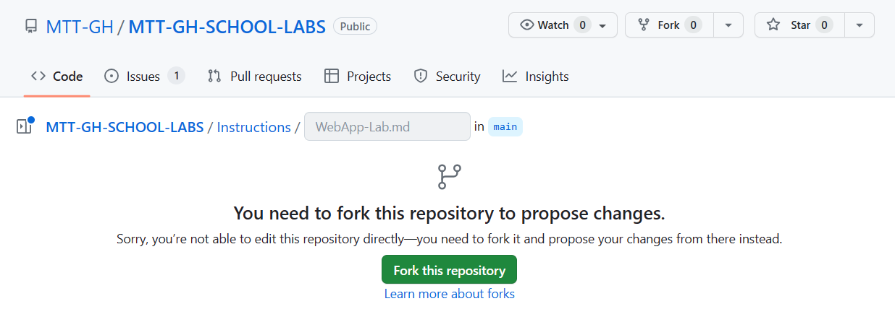
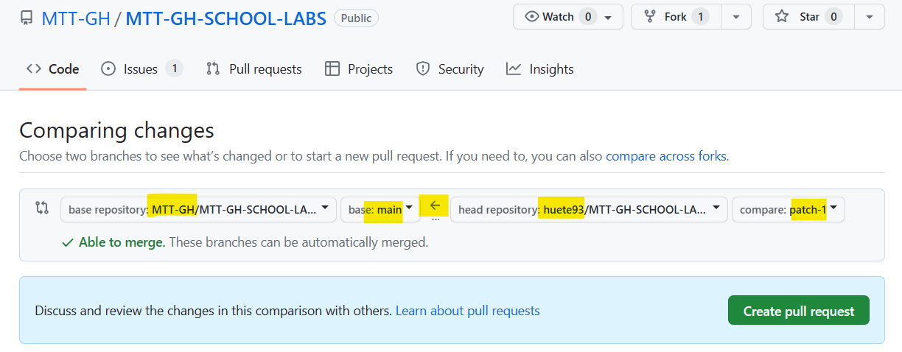

# MTT-GH-Fundamentals

This document contains the instructions for the MTT GH Fundamentals lab. The lab is designed to teach the basics of GitHub and how to use it to contribute to the MOC content used by MTTs.

The scenarios proposed in this lab are based on the real-life scenarios that MTTs face when contributing to the MOC content. It is composed of the following components:

- An **Source Repo (also called "Upstream")** that contains a simulated MOC content (https://github.com/MS-ESI/MTT-GH-Fundamentals). As mentioned on the learning material, the original repo is the source of truth for the content. It is the repo that contains the latest version of the content. The original repo is owned by the Content Owner (Content Devs in a real life scenario). As MTTs or learners, we can report issues and propose changes to the content by opening a PR in the original repo, **but we are not allowed to change it directly**.
- A **Forked repo (also called "Origin")** that contains a copy of the original repo. The forked repo is owned by the contributor (MTT in a real life scenario). The forked repo is used to **make changes to the content and propose them to the original repo**.


You could also involve a local clone (copy) of the repo in your local machine. **This is not required for the lab, it will try to teach the easiest way to collaborate with GitHub, only using web interface tooling**. 

You can perfectly collaborate in the MOC content without cloning the repo to your local machine. You can use the GitHub web interface to open issues, create PRs, review PRs, etc. This is the most common way to collaborate in GitHub as MTTs.


## Pre-requisites
- Make sure you have a **GitHub account**. If you don't have one, you can create one for free at https://github.com/join. Identify yourself as Microsoft MTT in your Profile (TODO guidelines?).
- Review the Learning material in ADD WEBSITE.

## Repository Structure
The repository is composed of the following files/folders:
- **README.md**: This file. Contains the instructions for the lab.
- **Instructions** folder: Contains the instructions for the demo lab we will collaborate in.
    - **media** folder: Contains the images used in the instructions.
    - **Lab1.md**: Instructions for the first demo lab.

## Lab Instructions

### Lab 1: Create a GH Issue
In this lab you are going to report an existing issue in the content by opening a new issue in the source repo (Upstream). This is the most common way to report an issue. 

GitHub Issues are used not only to report bugs, but also to propose new features, ask questions, etc (you can use labels for categorizing). It is something similar to work items used by Azure DevOps.

When creating a new issue, you should provide:
- A descriptive title linked to the Lab and Issue
- Clear issue description
- Include screenshots or other media (if that helps to understand the issue)
- (Done in [Lab 2](#lab-2-create-a-pull-request-intermediate)) Include a link to the PR that fixes the issue.

#### Exercise

1. Make sure you are in the MS-ESI/MTT-GH-Fundamentals repo. You are going to use the source repository to report an issue found in the lab.
1. Go to the [Lab1.md](Instructions/Lab1.md) file.

1. On Exercise 1 > Task 1 you can see there is an issue with the table format. You will be reporting this issue in the source repo (Upstream).

    

1. Click on the **Issues** tab in the repo (make sure you are in the MS-ESI/MTT-GH-Fundamentals repo). Click on the **New issue** button.

1. Provide a descriptive title for the issue. For example: **Lab 1: E1T1 - Table format is not correct**.
1. Provide a description to the issue. For example:

    ```The table format is not correct. The table is not rendered correctly in the GitHub UI.```
1. Include an image of the issue. You can use the Snagit tool (or others) to capture the image and pointing the problem. You can attach it just by **pasting** into the issue description.

1. Click on the **Submit new issue** button. Your issue should be created and look similar to the following [issue](https://github.com/MS-ESI/MTT-GH-Fundamentals/issues/2)  (some exercises to be done still ):

    

1. You may need to collaborate further using the **comment section** of the issue, which is used fo conversation with other users and content owners (you can tag people using "@").
1. Content Owners may also add labels to the issue to categorize it. For example, adding the **bug** label to the issue.

1. Once reviewed and fixed, the issue will be closed by the Content Owner. You will still work on the issue during next labs. 


### Lab 2: Create a Pull Request (Beginner)
You are going to create a PR from a forked repo. This is the most common way to collaborate on a public repository (as many OSS projects do). You will need to create a fork of the source repo (upstream), make changes to a branch in the fork, and then create a PR from the fork to the upstream repo (source).

Before starting, lets cover some basic concepts:

- A repository being public **does NOT mean anyone can make changes to it**. You need to be granted permissions to do so or **you need to propose changes using a fork of the source repo for experimentation**. In the case of the MOC content, only the Content Owner (Content Devs in a real life scenario) has permissions to make changes to the original repo. MTTs need to collaborate using PRs.
- A **Pull Request (PR)** is a request to merge changes from a branch in a forked repo to a branch in the source repo. The PR is used to propose changes to the source repo. The PR is a conversation between the contributor and the Content Owner. The Content Owner will review the PR and collaborate with the contributor to make sure the PR is ready to merge. The PR is the most common way to collaborate in GitHub.
- In your case you will have:
    - MS-ESI/MTT-GH-Fundamentals repo (Upstream): The **source repo**. The "stable" version of the content. The repo that contains the original content.
    - YOUR-ORG-OR-ACCOUNT/MTT-GH-Fundamentals repo (Fork): The **forked repo**. A copy of the source repo in your GitHub account. You will be making changes to this repo.

#### Exercise

1. Go to the MS-ESI/MTT-GH-Fundamentals repo (if not there already). Lets try to make a change to the source repo to see what happens.
1. In **Code** tab, go to the `Instructions/Lab1.md` file. Look for the following table syntax issue reported on previous lab. 

    

1. Open the editor clicking on the edit icon (pencil, top right corner). You will see the following warning message:

    

1. The warning explains how a fork has been created for you to experiment on your proposed changes (as you do not have write permissions to the source repo). The proposed changes will be made in a branch in your forked repo. You will need to create a PR from your fork to the source repo to propose the changes.

1. Start by proposing the change to the table format. You can use the **Preview** tab to see how the table will look like once the changes are applied.

    

1. Go to the bottom and on the **Propose changes** section, provide a descriptive message for the commit. For example: **Fix table format**. Leave the **extended description** empty. Click on **Propose changes**.
1. At this point you have made the **changes to a branch(default name given, for example, "patch-1") in your forked repo**. You need to create a PR from your fork to the source repo to propose the changes. The GitHub UI will guide you through the process of opening a PR from your fork to the source repo.

    

1. As you can see in the image above, GitHub is proposing you to open a PR **from** a branch your forked repo **to** the default branch of the source repo. You can change the source and target branches if needed. Click on **Create pull request**.

1. In the **Open a pull request** window, provide a descriptive title for the PR. For example: **Fix table format in Lab1.md**. Provide a description to the PR. For example:

    ```The table format is not correct. The table is not rendered correctly.```    
1. As this PR is trying to fix and existing&reported issue, you can include a reference to the issue (use your Issue number #) in the PR description.**This is great to trace the status of the issue from both the Issue or PR (on the Development field of the items, right column)**. Include a reference to the issue in the PR description. For example:

    ```Fixes #2```

1. Click on **Create pull request**. Your PR should be created and look similar to the following [PR](https://github.com/MS-ESI/MTT-GH-Fundamentals/pull/3).

1. Now if you open the GH Issue from lab one, you will see a reference to the PR that fixes the issue. 

    


### Lab 3: Create a Pull Request (Intermediate)
Create a PR from the forked repo, proposing a image update.

**ISSUE**: The image in the `Lab1.md` file is outdated and contains trainer personal data. The image should be updated to reflect the latest UI changes. Use tools like Snagit to capture the new image and propose the change in the PR.

### Lab 4: Review a Pull Request (Beginner)
Imagine you are the Content Owner/Courseware Lead. Review and collaborate with the contributor to make sure the PR is ready to merge.

You will include a reference to the GH Issues that are fixed by this PR.

## Lab 5: Review a Pull Request (Intermediate)
Imagine you are the Content Owner/Courseware Lead. Review and collaborate with the contributor to make sure the PR is ready to merge.

You will suggest a change to the proposed PR. The contributor will need to accept the change and update the PR.